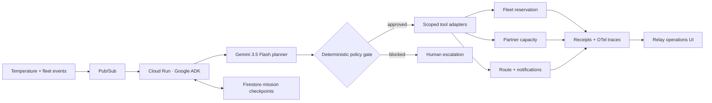

# Relay — Autonomous Food Rescue OS

> When a refrigerated truck fails, Relay turns one cold-chain event into a policy-bounded rescue mission—and leaves a receipt for every action.

Relay is a **Taskmaster** entry for the 2026 [All Things Agentic Hackathon](https://allthingsagentichackathon.devpost.com/). It uses **Gemini 3.5 Flash**, **Google Agent Development Kit**, and a **Cloud Run-ready** agent service to protect perishable food before its safety window closes.

[Live product](https://relay-food-rescue.srivibhavpadakandla.chatgpt.site/) · [Submission copy](SUBMISSION.md) · [Architecture](docs/architecture.mmd) · [Verified local ADK run](docs/evidence/LOCAL_ADK_RUN.md)

## The 10-second demo

Open the live product and click **Run rescue**. Relay:

1. ingests a simulated Pub/Sub cold-chain event;
2. asks Gemini 3.5 Flash for a recovery plan;
3. applies deterministic spend, partner, and privacy policy;
4. reserves backup vehicle V-08;
5. claims 760 + 480 meals of verified partner capacity;
6. dispatches the route and produces idempotent receipts.

The UI is intentionally deterministic for judging. The repository also contains the real ADK agent that executed the same mission against Gemini 3.5 Flash.

## Why this is agentic

Relay is not a chat interface. A machine event triggers a goal, Gemini plans a multi-step response, scoped tools change operational state, and deterministic policy can block unsafe actions. The run is resumable: every side effect carries a mission-scoped idempotency key, so retries return the original receipt instead of repeating the action.

## Architecture



The model proposes; code authorizes. See [the full architecture source](docs/architecture.mmd).

## Repository map

```text
app/                           Interactive React mission-control UI
app/components/react-bits.tsx  React Bits-style UI primitives
services/relay_agent/          Google ADK agent and policy-bounded tools
services/tests/                Idempotency and guardrail tests
scripts/deploy-cloud-run.sh    Reproducible Cloud Run deployment
docs/                          Architecture, evidence, demo and security notes
```

## Run the product UI

Requirements: Node.js 22.13 or newer.

```bash
npm install
npm run dev
```

Open `http://localhost:3000` and click **Run rescue**.

Validation:

```bash
npm test
npm run lint
```

## Run the Google ADK agent locally

Requirements: Python 3.12 and a Gemini API key.

```bash
python3.12 -m venv .venv
source .venv/bin/activate
pip install -r services/requirements.txt
export GOOGLE_API_KEY="your-key"
export GOOGLE_GENAI_USE_VERTEXAI=FALSE
adk api_server --host 127.0.0.1 --port 8080 services
```

In another terminal:

```bash
curl -X POST http://127.0.0.1:8080/apps/relay_agent/users/demo/sessions/rly-2048 \
  -H 'Content-Type: application/json' -d '{}'

curl -X POST http://127.0.0.1:8080/run \
  -H 'Content-Type: application/json' \
  -d '{"appName":"relay_agent","userId":"demo","sessionId":"rly-2048","newMessage":{"role":"user","parts":[{"text":"Truck R-14 refrigeration failed. Rescue all 1,240 meals for mission RLY-2048 within 71 minutes and return the final receipt."}]}}'
```

## Deploy the agent to Google Cloud Run

Requirements: a billed Google Cloud project and the Google Cloud CLI.

```bash
gcloud auth login
export GOOGLE_CLOUD_PROJECT="your-project-id"
export GOOGLE_CLOUD_LOCATION="us-central1"
./scripts/deploy-cloud-run.sh
```

The script enables Cloud Run, Cloud Build, Artifact Registry, and Vertex AI, deploys the ADK API server, configures `gemini-3.5-flash`, and prints the `.run.app` URL.

## Safety and failure handling

- `$250` deterministic spend ceiling
- approved partner registry; unknown destinations are blocked
- no PII in tool payloads
- idempotency keys on every side effect
- bounded retry and receipt replay
- explicit blocked-action reporting rather than fabricated success
- OpenTelemetry-compatible ADK execution traces

See [security and trust boundaries](docs/SECURITY.md).

## UI stack

The interface uses React 19, Anime.js for deterministic timeline motion, Lucide icons, and locally owned React Bits-style primitives (SpotlightCard, MagnetButton, CountUp, and ShinyText). The UI respects `prefers-reduced-motion` and remains keyboard accessible.

## License

[MIT](LICENSE)
