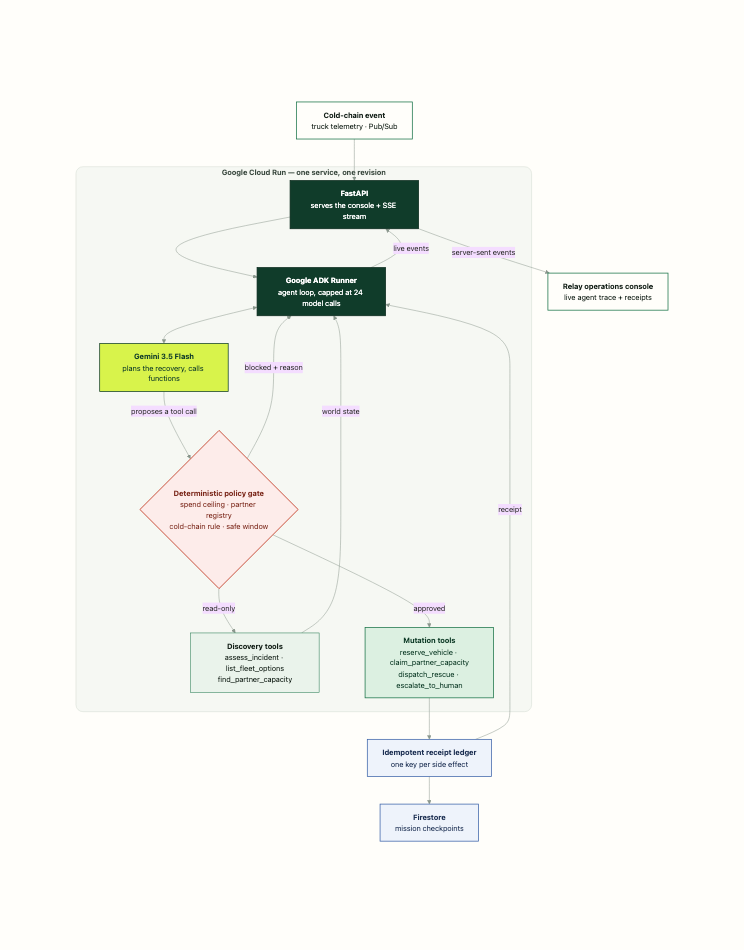

# Relay — Autonomous Food Rescue OS

> When a refrigerated truck fails, Relay turns one cold-chain event into a
> policy-bounded rescue mission — and leaves a receipt for every action.

Relay is a **Taskmaster** entry for the 2026
[All Things Agentic Hackathon](https://allthingsagentichackathon.devpost.com/).
It runs **Gemini 3.5 Flash** inside the **Google Agent Development Kit**, on a
single **Google Cloud Run** service that serves both the agent and the
operations console.

**[Live demo](https://relay-food-rescue-PLACEHOLDER.run.app)** ·
[Submission notes](SUBMISSION.md) ·
[Architecture](#architecture) ·
[Verified agent runs](docs/evidence/LOCAL_ADK_RUN.md)

---

## What it does

A refrigerated truck loses cooling. 1,240 prepared meals have 71 minutes before
they leave the food-safety window. Recovering them normally means an operator
working across a fleet system, an inventory record, a partner directory, a
routing tool, a messaging tool and a budget policy — while the food warms up.

Relay does that work autonomously:

1. reads the incident and the constraints that bind it;
2. **discovers** what vehicles and partner capacity actually exist;
3. plans a recovery with Gemini 3.5 Flash;
4. has every proposed action checked by a deterministic policy gate;
5. reserves the vehicle, claims partner capacity, and dispatches the route;
6. escalates anything it genuinely cannot solve;
7. writes an idempotent receipt for every side effect.

The landing page at `/` explains the problem and the design rule; the live
console at `/console` runs it. Press **Run rescue** there and you are watching
real Gemini tool calls against a live policy gate. Nothing is pre-recorded.

## Why this is agentic, not a chatbot

A machine event starts a goal. The model plans. Scoped tools change operational
state. Deterministic code can refuse. The design rule is:

> **The model proposes. Policy decides. Tools prove.**

Gemini is never told the answer. It is handed a plain-language incident and has
to find the fleet, compare cost against the spend ceiling, check whether a
vehicle is refrigerated, respect the partner registry, and split the load when
no single partner is large enough. Cost is read from the fleet record rather
than from the model's own arguments, so the ceiling cannot be argued around.

### Three missions ship with it

| Mission | Situation | What the agent has to work out |
|---|---|---|
| `RLY-2048` | 1,240 meals, 71 min, $250 ceiling | No single partner can take the load; it must be split |
| `RLY-2071` | 900 meals, 40 min, **$150 ceiling** | The fastest van breaks the budget, the cheapest is not refrigerated |
| `RLY-2090` | 1,500 meals, verified capacity of 1,050 | Unsolvable — it must rescue 1,050 and **escalate 450** |

`RLY-2090` is the important one. The agent dispatches only what confirmed
capacity covers and hands the remaining 450 meals to a human, rather than
reporting a clean success it cannot back with receipts.

## Architecture



One Cloud Run service runs FastAPI, the ADK agent loop and the console, so the
judge-facing product and the agent share an origin, a deployment and a
revision. [Diagram source](docs/architecture.mmd).

| Layer | Technology |
|---|---|
| Planning | Gemini 3.5 Flash (Vertex AI in production, Gemini API locally) |
| Agent framework | Google Agent Development Kit 1.18 |
| Runtime | Google Cloud Run (container, autoscaled) |
| Checkpoints | Firestore when `RELAY_FIRESTORE=1`, in-memory otherwise |
| Event trigger | Cloud Pub/Sub in the production design; the console posts directly today |
| Front end | React 19 + Vite. Landing page animated with Anime.js v4 (split text, drawable SVG, motion path); console consumes a server-sent event stream |

### Guardrails

- a per-mission spend ceiling, enforced against the fleet's own prices
- an approved partner registry; display names and unknown IDs are refused
- warm loads require a refrigerated vehicle
- vehicles and partners outside the safe window are refused
- dispatch cannot exceed confirmed capacity claims
- every side effect requires a mission-scoped idempotency key
- the agent loop is capped at 24 model calls so a stuck run fails cheaply
- no PII in tool payloads or receipts

See [security and trust boundaries](docs/SECURITY.md).

## Run it locally

Requirements: Python 3.12, Node.js 22, and a
[Gemini API key](https://aistudio.google.com/apikey).

```bash
git clone https://github.com/srivibhavpadakandla/relay-food-rescue.git
cd relay-food-rescue

python3.12 -m venv .venv && source .venv/bin/activate
pip install -r services/requirements.txt

export GEMINI_API_KEY="your-key"
./scripts/run-local.sh
```

Open <http://127.0.0.1:8080> for the landing page, then **Watch it run** (or go
straight to <http://127.0.0.1:8080/console>) and press **Run rescue**.

### Tests

```bash
PYTHONPATH=services python -m unittest discover -s services/tests -v
```

19 tests cover the spend ceiling, the partner registry, the cold-chain rule,
dispatch coverage, escalation, and idempotent replay.

### Front-end development

```bash
cd services && python -m uvicorn relay_agent.server:app --port 8080   # terminal 1
cd ui && npm install && npm run dev                                   # terminal 2
```

Vite serves the console on `:5173` and proxies `/api` to the agent.

## Deploy to Google Cloud Run

Requirements: a billed Google Cloud project and the `gcloud` CLI.

```bash
gcloud auth login
export GOOGLE_CLOUD_PROJECT="your-project-id"
./scripts/deploy-cloud-run.sh
```

The script enables Cloud Run, Cloud Build, Artifact Registry, Vertex AI and
Firestore, builds the container from source, deploys it, and prints the public
`.run.app` URL. It uses Vertex AI for model access by default, so no API key is
baked into the image.

Confirm the deployment:

```bash
curl https://<your-service>.run.app/healthz
```

```json
{
  "status": "ok",
  "model": "gemini-3.5-flash",
  "vertex_ai": true,
  "revision": "relay-agent-00001-abc",
  "service": "relay-agent",
  "checkpoint_backend": "firestore"
}
```

The console's left rail and the **Deployment evidence** card read from this
endpoint, so the live Cloud Run revision is visible in the product itself.

## Repository map

```text
services/relay_agent/agent.py    ADK agent, tool contracts and policy gates
services/relay_agent/world.py    Fleet, partner network and mission scenarios
services/relay_agent/state.py    Idempotent receipt ledger + Firestore checkpoints
services/relay_agent/server.py   FastAPI: console, SSE mission stream, health
services/tests/                  Policy-gate and idempotency tests
ui/src/Landing.tsx               Animated landing page (anime.js)
ui/src/Console.tsx               Live mission-control console
ui/src/agentStream.ts            SSE client for the agent event stream
scripts/run-local.sh             One-command local run
scripts/deploy-cloud-run.sh      Reproducible Cloud Run deployment
docs/                            Architecture, verified runs, security notes
Dockerfile                       Multi-stage build: console + agent, one image
```

## License

[MIT](LICENSE)
