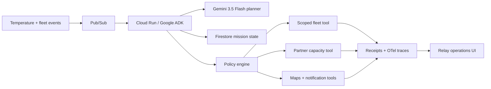

# Relay — Autonomous Food Rescue

Relay is a Taskmaster-track prototype for the 2026 All Things Agentic Hackathon. It watches cold-chain events, reasons over inventory and partner capacity, then executes a policy-bounded rescue plan before food becomes unsafe.

## Demo

The web experience ships with a deterministic mission so judges can see the entire action chain in under ten seconds: reserve a backup vehicle, confirm two recipient sites, dispatch the new route, send notifications, and produce an auditable receipt.

## Target architecture



The planner proposes actions; the policy engine authorizes only scoped, reversible tools. Every tool call carries a mission ID and idempotency key. Mission state is checkpointed after every transition, so Pub/Sub redelivery resumes work without repeating side effects.

## Local UI

```bash
npm install
npm run dev
```

## Production build

```bash
npm run build
```

## Hackathon qualification work remaining

The repository currently contains the polished interactive product demonstration. Before submission, add and deploy the Google ADK service represented above, configure Gemini 3.5 Flash and Firestore, connect at least one real or explicitly simulated tool adapter, run failure-path evals, and record visible Cloud Run/Vertex execution proof. Do not claim those integrations until they are deployed and recorded.

